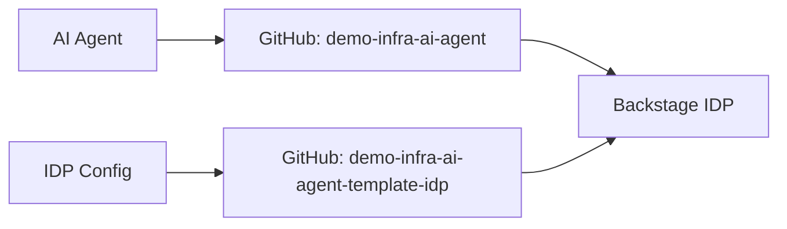

# 📋 Gestión de Catálogos - Backstage IDP

## 🏗️ Arquitectura de Catálogos

### 📡 **Catálogos en GitHub (Todo centralizado)**

**Repositorio Principal**: `giovanemere/demo-infra-ai-agent`
- **Archivo**: `catalog-info.yaml`
- **Contenido**: Componentes y APIs del AI Agent
- **Sincronización**: Automática cada 5 minutos

**Repositorio IDP**: `giovanemere/demo-infra-ai-agent-template-idp`
- **Archivo**: `catalog-info.yaml` (raíz)
- **Carpetas**: `components/`, `systems/`, `resources/`, `templates/`
- **Contenido**: Configuración del IDP, usuarios, grupos, templates
- **Sincronización**: Automática cada 5 minutos

## 🔄 Flujo de Sincronización



1. **AI Agent** genera componentes → **GitHub** (`demo-infra-ai-agent/catalog-info.yaml`)
2. **Configuración IDP** → **GitHub** (`demo-infra-ai-agent-template-idp/`)
3. **Backstage** sincroniza automáticamente desde ambos repositorios
4. **Sin archivos locales** - Todo centralizado en GitHub

## 📁 Estructura de Repositorios

### `demo-infra-ai-agent`
```
├── catalog-info.yaml          # Componentes del AI Agent
├── src/                       # Código fuente
└── docs/                      # Documentación
```

### `demo-infra-ai-agent-template-idp`
```
├── catalog-info.yaml          # Configuración base del IDP
├── components/                # Componentes generados
├── systems/                   # Sistemas
├── resources/                 # Recursos
├── templates/                 # Templates de Scaffolder
└── docs/                      # Documentación
```

## ⚙️ Configuración

### Variables de Entorno (.env)
```bash
# GitHub Integration
GITHUB_TOKEN=ghp_xxx
GITHUB_ORG=giovanemere
GITHUB_REPO=demo-infra-ai-agent
GITHUB_BRANCH=main
CATALOG_PATH=/catalog-info.yaml
```

### Configuración de Catálogo (app-config.yaml)
```yaml
catalog:
  locations:
    # Componentes del AI Agent
    - type: url
      target: https://github.com/${GITHUB_ORG}/${GITHUB_REPO}/blob/${GITHUB_BRANCH}${CATALOG_PATH}
    
    # Configuración del IDP y templates
    - type: url
      target: https://github.com/${GITHUB_ORG}/demo-infra-ai-agent-template-idp/blob/main/
```

## 🚀 Comandos

### Verificar Sincronización
```bash
./scripts/verify-catalog-sync.sh
```

### Verificar Templates
```bash
./scripts/check-template-sync.sh
```

### Diagnóstico Completo
```bash
./scripts/system-check.sh
```

## ✅ Ventajas de la Centralización en GitHub

1. **Versionado**: Todos los cambios están versionados
2. **Colaboración**: Múltiples personas pueden contribuir
3. **Backup**: GitHub actúa como backup automático
4. **Sincronización**: Cambios automáticos en Backstage
5. **Auditoria**: Historial completo de cambios
6. **Sin archivos locales**: Eliminación de inconsistencias

## 🔍 Verificaciones

El sistema verifica automáticamente:
- ✅ Conexión a GitHub
- ✅ Acceso a repositorios
- ✅ Existencia de catálogos
- ✅ Sincronización activa
- ✅ Sin dependencias locales
